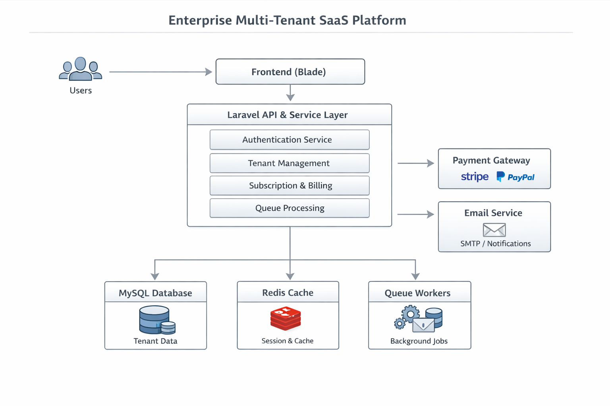

# Enterprise Multi-Tenant SaaS Platform

## 📌 Overview

This project demonstrates the architecture and system design of a scalable multi-tenant SaaS application built with Laravel.

It is designed as a case study to showcase enterprise-level engineering practices while keeping all client-specific data private.

---

## 🎯 Business Objectives

- Build a scalable SaaS platform
- Support multiple organizations (tenants)
- Ensure secure data isolation
- Implement subscription-based access control
- Maintain high performance and long-term scalability
- Design a maintainable and modular system

---

## 🏗 System Overview

This multi-tenant architecture is designed for:

- Multiple organizations
- Isolated tenant data
- Subscription-based access
- Secure role management
- API-driven communication
- Scalable growth

---

## 🧩 Architecture Highlights

- Multi-tenant system design
- Role-based access control (RBAC)
- RESTful API structure
- Modular codebase architecture
- Secure authentication system
- Payment gateway integration
- Optimized database schema
- Production-ready deployment structure

---

## 🛠 Technology Stack

**Backend:** Laravel (PHP)  
**Frontend:** React.js  
**Database:** MySQL  
**Version Control:** Git  
**Architecture Type:** Multi-Tenant SaaS  
**Deployment:** Production-ready infrastructure  

---

## 🚀 Key Features

✔ Tenant Isolation  
✔ Subscription Management  
✔ Admin Dashboard  
✔ API-Driven Design  
✔ Secure Authentication  
✔ Scalable Database Structure  
✔ Performance Optimization  

---

## 🏛 System Design Principles

- Clean Architecture
- SOLID Principles
- Security-First Development
- Scalable System Design
- Maintainable Code Structure
- Business-Oriented Engineering

---

## 📊 Business Impact

The architecture was designed to support:

- Future scalability
- High concurrent users
- Modular feature expansion
- Long-term maintainability
- Enterprise-level reliability

---

## 🖼 Architecture Diagram

(Add your architecture diagram image here)

Example:

```markdown

